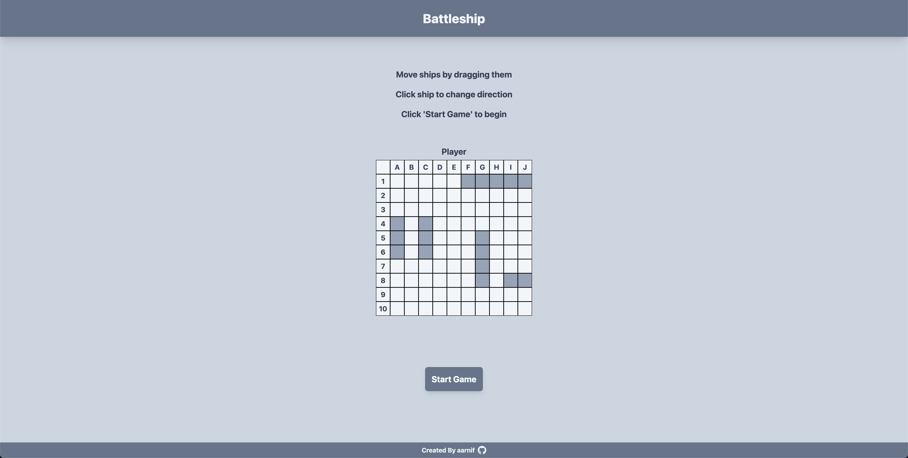

# Battleship

This is an battleship game built with HTML, Tailwind CSS and JavaScript.
The project is part of the [The Odin Project's](https://www.theodinproject.com/) Full Stack JavaScript Course.

## Features

- The game is played on a 10x10 grid.
- The player can place ships on the grid.
- The player can attack the enemy grid.
- The game ends when all ships are sunk.

## Live Preview

[BATTLESHIP](https://aarnif.github.io/odin-battleship/)

## Technologies

- HTML
- Tailwind CSS
- JavaScript

## Image


Image of the project.

## Instructions

```
HTTPS - git clone https://github.com/aarnif/odin-battleship.git

SSH - git clone git@github.com:aarnif/odin-battleship.git

cd odin-battleship

npm install

npm run dev # For development

npm run build # For production
```
